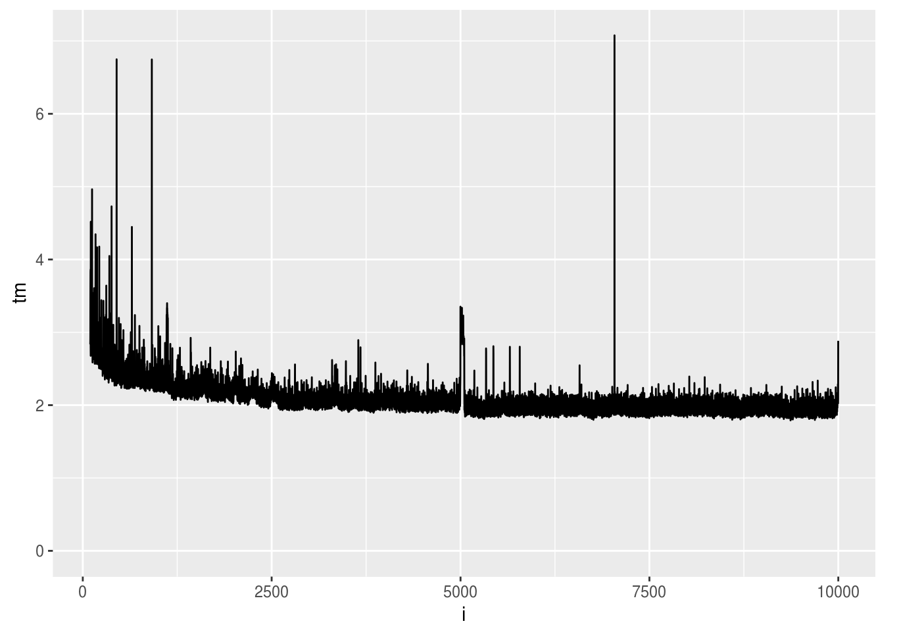

## h2o.ai

The steps below correspond to the files in this subdir.

1. Train (LR/RF/GBM/NN) and save model as POJO/MOJO.

2. Use steam to build war from POJO/MOJO.

3. Running the web service.

4. Measure the REST round-trip (via local network) from sequential Python client and plot the results. 

Timing for GBM POJO:

JVM needs warming up. Also there are hickups (even 1 sec) (garbage collection?)

5. Loop over all algos and get median response time:

Algo | P/M  | Time (ms)
-----|------|------------
LR   | POJO | 2.05516815186
LR   | MOJO | 2.07090377808
RF   | POJO | 2.28381156921
RF   | MOJO | 2.18892097473
GBM  | POJO | 2.31146812439
GBM  | MOJO | 2.14600563049
NN   | POJO | 2.1960735321

